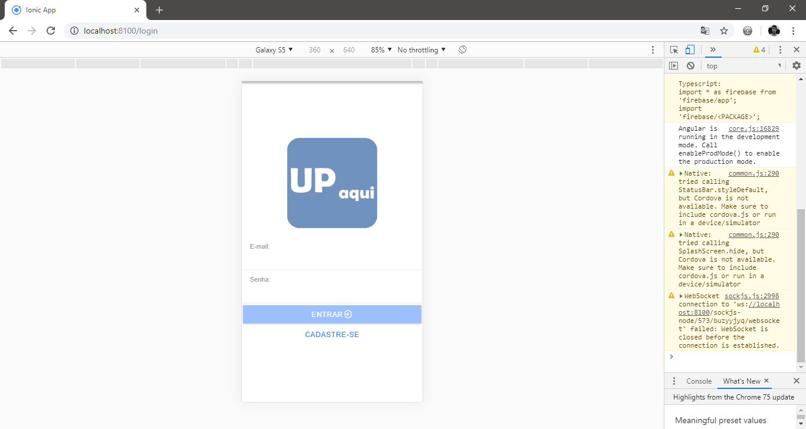
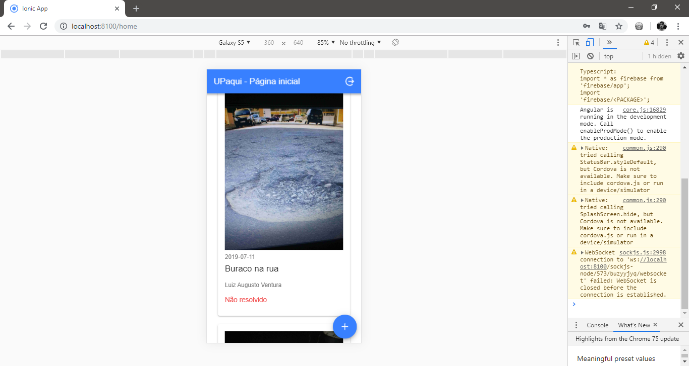
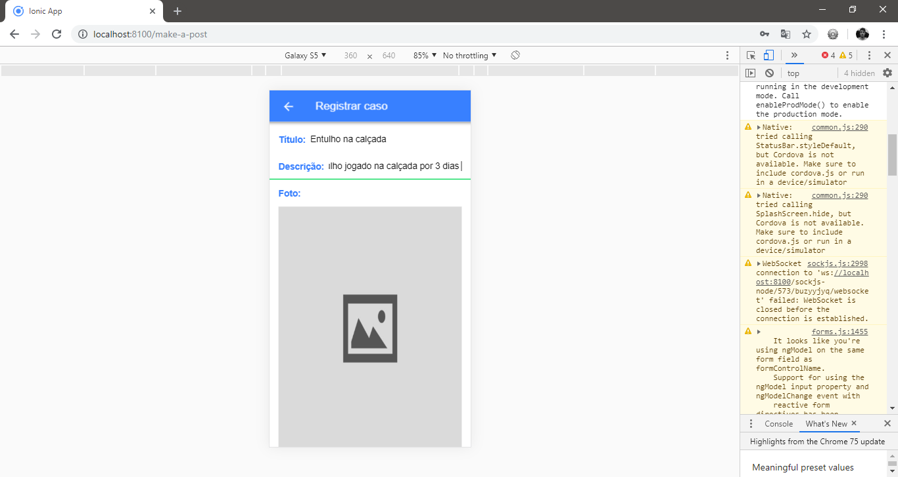
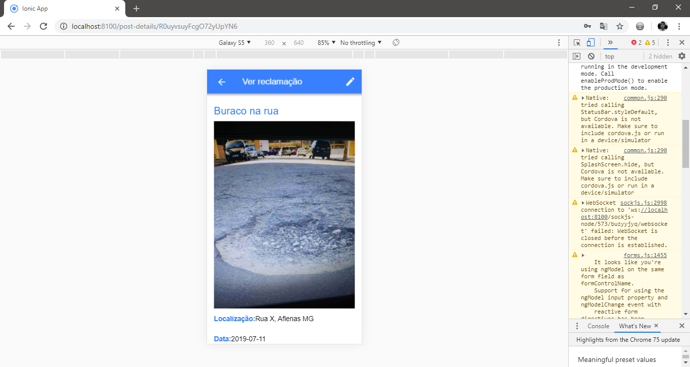
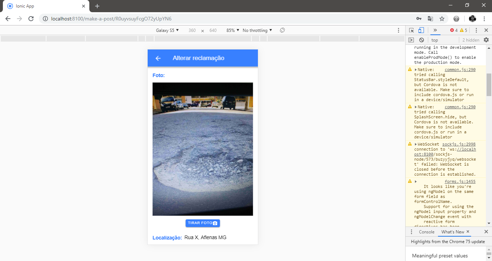

# UPaqui: Aplicação Ionic 4 voltada para a área de utilidade pública

  Projeto solicitado na disciplina de Programação para Dispositivos Móveis(7º Período) do curso de Ciência da Computação pelo professor Maurício, cujo objetivo é desenvolver uma aplicação móvel que utilize FireBase e recursos nativos do sistema operacional. 
  
  A partir dos requisitos mencionados, foi pensada uma aplicação voltada para a área de utilidade pública, onde usuários podem, a partir de uma descrição textual e uma fotografia, registrar reclamações acerca de situações de desacaso e negligência por parte de orgãos públicos. 
  
  Como recurso nativo foi utilizada a câmera.
  
### Executando aplicação:

**npm install**:
Instala os módulos e dependências necessários à aplicação.

**ionic cordova prepare android**:
Compila a aplicação para o sistema Android, gerando todos os arquivos e recursos necessários.

**ionic cordova run android --device**:
Por fim, instala e executa a aplicação no dispositivo físico. 

##### Colaborador: Willian Mariano

#### Capturas de tela: 

#### Pacotes Utilizados:

**Angular:**

Angular CLI: 7.3.5

Node: 10.15.1

OS: win32 x64

Angular:
...

**Package --------------------- Version**

@angular-devkit/architect --- 0.13.5

@angular-devkit/core -------- 7.3.5

@angular-devkit/schematics - 7.3.5

@schematics/angular --------- 7.3.5

@schematics/update --------- 0.13.5

rxjs ----------------------------- 6.3.3

typescript ---------------------- 3.2.4

----------------------------------------------

**Ionic:**

Ionic 4.12.0
